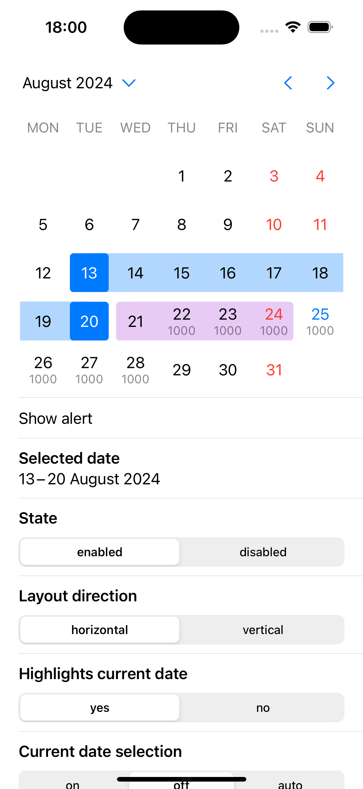
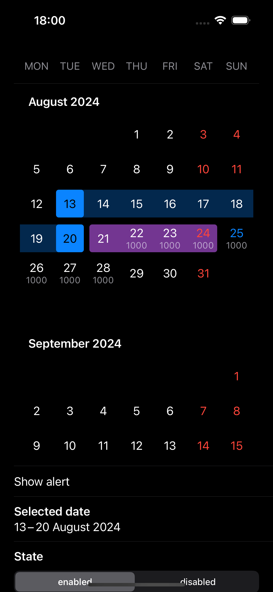

# DatePicker

iOS 14+ calendar style date picker. Almost a drop-in replacement of the native UIDatePicker.

<p align="center">


</p>

## Features

- Vertical and horizontal calendar layouts
- Range selection
- "Infinite" scrolling
- UIDatePicker compatible API
- Annotations, custom ranges and more

## Installation using SPM

```swift
.package(url: "https://github.com/cianru/ios-datepicker", exact: "1.0.0")
```

## Examples

`DatePickerDemo.xcworkspace` contains the example application project.

## Usage

```swift
let datePicker = DatePicker()
datePicker.addAction(UIAction { _ in
    print("Selected date: \(datePicker.date)")
}, for: .valueChanged)
```

See [`DatePickerProtocol.swift`](Sources/DatePicker/DatePickerProtocol.swift) for all possible parameters.

## SwiftUI

SwiftUI isn't supported yet, but you can use [`DatePickerUIViewRepresentable.swift`](DatePickerDemo/DatePickerDemo/DatePickerUIViewRepresentable.swift) as an example `UIViewRepresentable` implementation.

## Customization

You can provide `DatePickerSettings` with custom appearance and accessibility settings: colors, fonts, images, accessibility identifiers and labels:

```swift
var settings = DatePickerSettings()
settings.appearance.colors.text.accent = .systemRed

// Settings for specific instance
let datePicker = DatePicker(settings: settings)
```

Also you can change those settings globally for every instance of `DatePicker`:

```swift
var settings = DatePickerSettings()
settings.appearance.colors.control.primary = .systemRed
settings.appearance.colors.control.secondary = .systemRed.withAlphaComponent(0.3)

// Global settings
DatePickerSettings.default = settings
```

See [`DatePickerSettings.swift`](Sources/DatePicker/DatePickerSettings.swift) for all possible customization settings.
